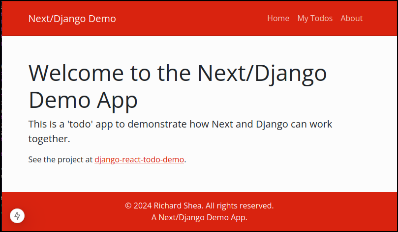

# Demonstrating how to use React with Django

This project for use in workshops etc to demonstrate an 'end-to-end' experience of using React on the front end and Django on the backend.

To demonstrate the project in use it's necessary to start both a Django instance and to use the react development server. Notes on how to do this are below.



## Development Notes

### Pipenv/Virtualenv

This project makes use of pipenv so the virtualenv needs to be started in the pipenv way and there is no `requirements.txt`.


### Running backend locally 

Don't forget when running the dev server you have to enable access from outside the VM by modifying the default binding. It's also necessary to reference the relevant settings file.

Here's an example of doing that.

```
python manage.py runserver 0.0.0.0:8000 --settings=backend.settings.local
```

### Running frontend locally

```
yarn start
```

### Environmentally Aware Settings

## Django Settings
Multiple settings files are defined to deal with different environments, they are all contained in `backend.settings` and need to be referenced when using the `manage.py` command. 

## Django - Use of Environmental Variables
Secrets are kept in environmental variables.

The use of the [direnv utility](https://direnv.net), in conjunction with a .envrc file, results in the environmental variables being autoloaded when the current directory is the project root (or child directories of that).

The .envrc file is not committed to the repos but the .envrc_TEMPLATE file, which is committed, provides guidance on what should appear in the .envrc.

## Regenerating Django Secret Key
```
python -c 'from django.core.management.utils import get_random_secret_key; print(get_random_secret_key())'
```

# Django - Static Analysis
Static code analysis is done using [flake8](https://flake8.pycqa.org/en/latest/#).

## Executing the analysis

A `.flake8` configuration file controls how flake8 behaves, amongst other thing this configuration file allows some warnings to be suppressed and this is sometimes an appropriate action.

Execute the following from the project root directory.

```default
$ flake8 ./
```


